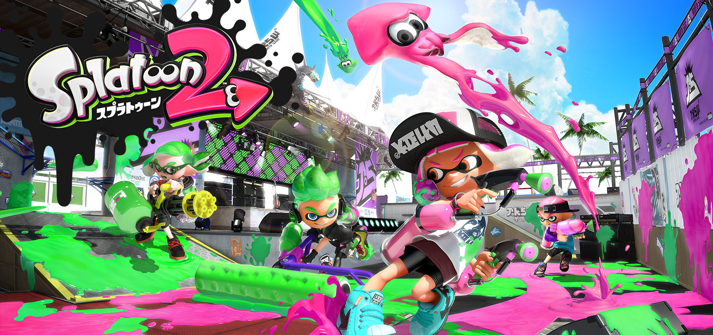
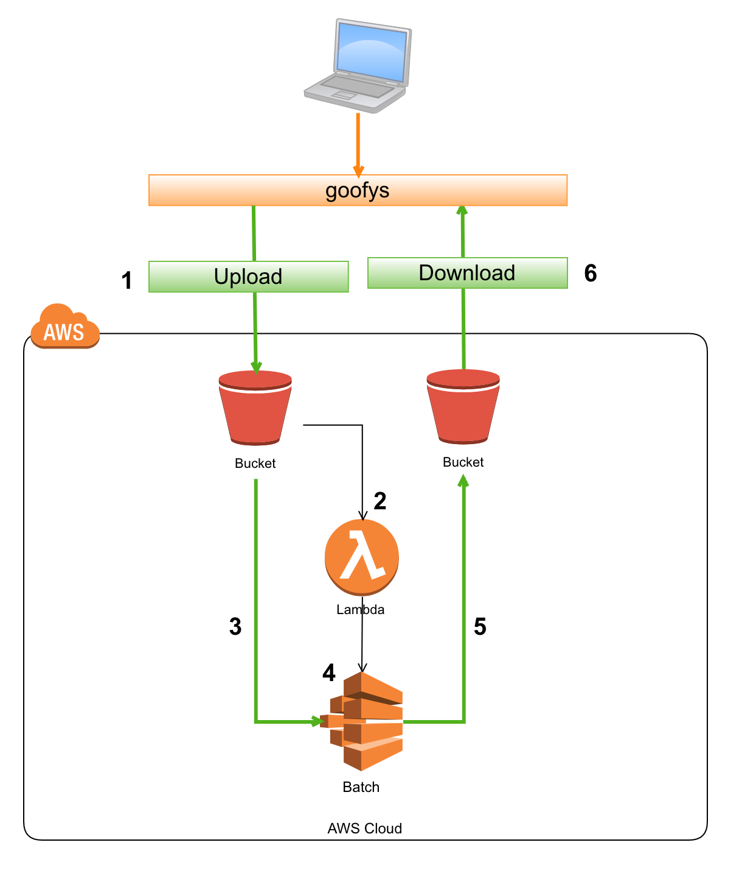
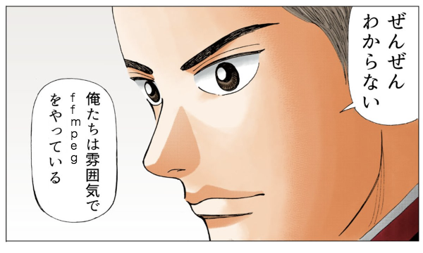

% Splatoon2の動画圧縮を楽にしたかった話
% yamotonalds
% 2017-11-06

# 2017-07-21

## Splatoon2発売

## 🐼はイカになった

## 頭の中はイカ

##

🐼「勉強会のネタ考えないと…」

 「イカ関係の何かにしよう」

##

戦績関連はアプリやサービスがある

めんどうなのは動画編集？

##

Switchには2017-10-19に録画機能追加

ボタンを押した前30秒が保存される

画質も良い

## でも

試合単位で録画したい

## 実は

Splatoon 1のときに録画環境は作ってて

2でも録画している

## 現在の動画圧縮の流れ

1. 録画フェイズ
    1. 古いMBAに繋いだキャプチャボードで録画
    1. 残したい動画をNASに転送
1. 編集フェイズ
    1. NASからゲーム兼動画編集用PCに転送
    1. AviUtl使って編集＆圧縮

. . .

🐼「めんどい」

## もっと楽に動画圧縮したい

具体的にはファイルをコピーしたら自動的に圧縮されてほしい

## というわけで

## そういう仕組みを作ってみました

## 撮ったイカを入れるので

## 魚籠(creel)

という名前にした

# 魚籠の構成

## ざっくり全体

## 動画圧縮

- AWS Batchを採用
    - 任意のDockerイメージを使ってコマンドタイプのコンテナ実行できるジョブサービス
    - 処理に時間がかかる系のジョブ向け
    - ポータビリティと再現性を確保したかった
- Dockerイメージ
    - ffmpegが動くイメージをベースにaws cliを追加
    - S3を入出力とするように簡単なスクリプトを追加

## 動画圧縮

S3にある動画を読み込んで、圧縮して、S3に書き出すところまでできた

## 処理のトリガー

- S3のイベント通知(Lambda)を採用
    - S3の指定したバケット（またはそのフォルダ）にファイルが作成されたらAWS Batchのジョブを叩く
    - 起動するジョブにはパラメーターを渡せるので、イベントに含まれる「作成されたファイル情報」を渡す

. . .

S3に動画が置かれたら自動的に圧縮が始まるところまでできた

## S3への自然なアクセス

- goofysを仮採用
    - Mac上にS3のバケットをマウントできる
    - 問題あり（後述）
    - s3fsも試したけど問題あり

. . .

Mac上でファイルをコピーしたら自動的に圧縮が始まって、終わったら見れるようになった

## もう一度全体図

# 満足ポイント

## コアの処理はDocker化できた

- ffmpegのイメージを作ってくれた人に感謝🙏
    - オプション調整とS3入出力のスクリプト書くだけで済んだ

## 使った分だけ課金になってる

- 入力ファイルはS3のライフサイクル設定で自動消滅
- Dockerが動くインスタンスは
    - ジョブに連動して作られる
    - 足りなければAuto Scale
    - ジョブが無くなったらterminate

# 困ったところ

## ffmpegというか動画のことがわからない

## AWS Batchが動かない

- ジョブが `RUNNABLE` から動かない
- AWS Batchのバックグラウンドを理解する必要があった
    - Batchが動くVPCは自分で作る必要がある
    - VPC上でAWS ECSが動くようにする必要がある

## AWS Batchが動かない

- ECS用EC2インスタンスは外部からアクセス可能にする設定が必要
- 自動的にIP割り振り・DNS解決の設定をONにする他、VPCの↓の設定も必要
    - サブネット
    - ルートテーブル
    - ゲートウェイ

# 問題点（未解決）

## goofysでマウントしてもFinderでファイルが書き込めない

- 「既にファイルが存在する」と言われる
- とても不便
- s3fsだとエラーコード `-36` のエラーが発生
- ファイル作成イベントが複数回発生

## 圧縮後のファイルがQuicktimeで開けない

- AviUtlで圧縮した動画はQuicktimeでも見れた
- 雰囲気でやってるので原因がよくわかってない

# 今後のやるかもなこと

## 未解決問題への対処

- S3マウントにこだわりはない
    - PCの配置上、タイピングしづらいだけ
- Quicktime再生
    - 善処する

## コスト削減

- コスト計算はまだしてないが
    - スポットインスタンスの使用
    - ffmpegのオプションやCPU・メモリ割り当てで処理の高速化

## 試合分割の自動化

- 1試合ごとに録画開始・停止を押すのめんどい
- 暗転検知できれば分割できそう？

## VPC周りの設定のコード化

- 今回はブラウザでやったけど絶対忘れる
- CloudFormationでコマンド1つにできそう

## GCPで同じことできるのか試す？

- AWS Batchの代わりにk8s Jobが使える？

# 時間があればコードや設定の詳細とか

